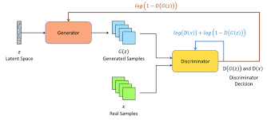
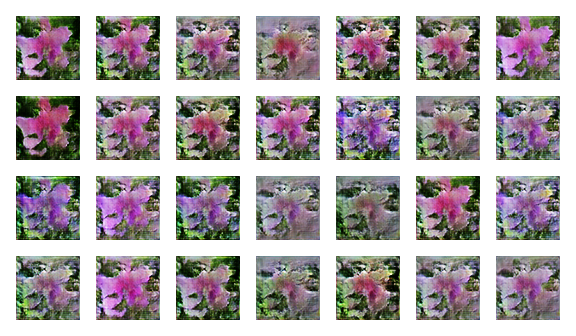

# Text-To-Image           

This project uses a Generative Adversarial Network (GAN) and Global Vectors for Word Representation (GloVe) to generate images from textual descriptions.  For this particular project, I have used flower images from the Oxford 102 Flower Dataset.

## Date:

The data of the image description was obtained from [here](https://drive.google.com/file/d/0B0ywwgffWnLLcms2WWJQRFNSWXM/view). 

The image caption data link was obtained from the following [github](https://github.com/zsdonghao/text-to-image).

The flowers dataset has 102 categories of flower images. Each category has 40-258 images. The total number of flower images-description pairs used in this project is 8100.

## Architecture:

The images are synthesized using the GAN-CLS Algorithm from the paper [Generative Adversarial Text-to-Image Synthesis](http://arxiv.org/abs/1605.05396). However, we have not used Skip-Thoughts vectors, instead, we tried the implementation using the GloVe embeddings.

## Output

For the given text :"this flower is purple in color with oval shaped petals"

